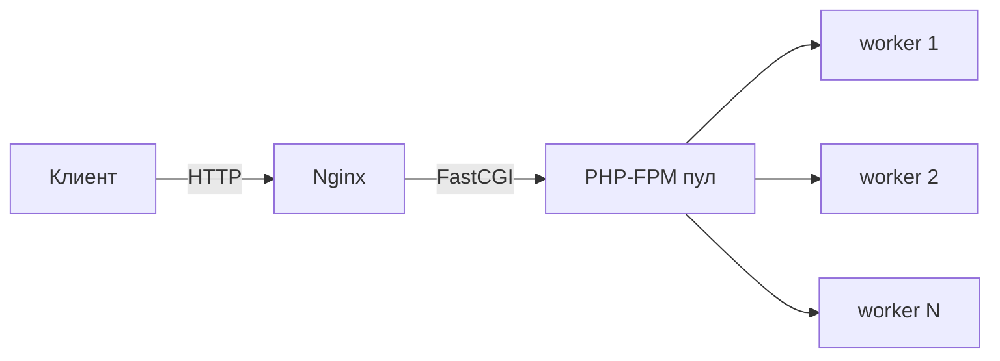

# PHP: язык и рантайм

Цель урока — за 15 минут закрыть базу про PHP, которую почти всегда спрашивают:
как устроено выполнение, чем отличаются версии 7.4/8, типы, ссылки, OPcache и
типичные грабли. Простым языком, с прицелом на устные ответы.

## Как PHP вообще выполняется

PHP — интерпретируемый язык, но не «строка за строкой». На каждый запрос
происходит:

1. **Лексинг + парсинг** исходника в AST.
2. **Компиляция** AST в opcodes (байткод движка Zend).
3. **Исполнение** opcodes виртуальной машиной Zend VM.

Без кеша шаги 1-2 повторяются на каждый запрос. **OPcache** хранит уже
скомпилированные opcodes в разделяемой памяти, поэтому компиляция происходит
один раз — это даёт основной прирост производительности на проде.

> [!tip] Что сказать на собесе
> «PHP компилируется в opcodes движком Zend и исполняется Zend VM. OPcache
> кеширует opcodes в shared memory, чтобы не перекомпилировать на каждый
> запрос.»

## Модель «shared-nothing»

Ключевая особенность PHP: на каждый HTTP-запрос — **свежее состояние**. После
ответа вся память запроса очищается. Между запросами по умолчанию ничего не
шарится (отсюда «shared-nothing»).

Плюсы: простота, нет утечек между запросами, легко масштабировать
горизонтально. Минусы: нельзя держать «горячее» состояние в памяти процесса —
для этого нужен внешний стор (Redis, БД).

## PHP-FPM: как обслуживаются запросы

На проде PHP обычно работает через **PHP-FPM** (FastCGI Process Manager).
Nginx принимает HTTP и проксирует в пул FPM-воркеров по протоколу FastCGI.
FPM держит пул процессов; каждый воркер обрабатывает один запрос за раз.

Параметры пула (`pm = dynamic/static/ondemand`, `pm.max_children`) определяют,
сколько одновременных запросов вы потянете. Слишком много воркеров — упрётесь в
память; слишком мало — запросы встанут в очередь.



## Типы и сравнения

PHP — динамически типизированный, но с опциональной строгой типизацией.

- `==` — нестрогое сравнение (с приведением типов).
- `===` — строгое (тип + значение). **На собесе всегда говори, что по умолчанию
  используешь `===`.**
- `declare(strict_types=1);` — включает строгий режим типов для скаляров в
  файле: PHP не будет молча кастовать `int` в `string` и наоборот.

В PHP 8 «магические» сравнения стали адекватнее: `0 == "foo"` теперь `false`
(в PHP 7 было `true`, потому что строка кастовалась в `0`).

## Что нового в PHP 8 (частый вопрос)

- **JIT** — компиляция части opcodes в машинный код. Заметно помогает на
  CPU-bound задачах, но для типичного web-IO выигрыш небольшой.
- **Именованные аргументы**: `foo(limit: 10)`.
- **Конструктор property promotion**: поля объявляются прямо в конструкторе.
- **Union types**: `int|string`.
- **`match`** — выражение, строгое сравнение, возвращает значение.
- **Nullsafe**: `$user?->getAddress()?->city`.
- **Атрибуты** (`#[Route(...)]`) вместо аннотаций в докблоках.
- **Enum** (с 8.1), **readonly**-свойства (8.1/8.2), **fibers** (8.1).

```php
// property promotion + union types + readonly (PHP 8.1)
class Money
{
    public function __construct(
        public readonly int $amount,
        public readonly string $currency = 'RUB',
    ) {}
}
```

## Ссылки, копирование и copy-on-write

PHP передаёт переменные **по значению**, но реально копия создаётся лениво —
**copy-on-write**: пока вы только читаете, обе переменные указывают на одни
данные; копия делается в момент записи.

Объекты ведут себя иначе: переменная хранит **хэндл объекта**. При передаче
объекта копируется хэндл, а не объект, поэтому изменения внутри функции видны
снаружи (но это не то же самое, что передача по ссылке `&`).

> [!warning] Грабли
> `$a = $b` для объекта не клонирует объект. Чтобы получить копию, нужен
> `clone` (и при необходимости `__clone()` для глубокого копирования).

## Управление памятью

- Подсчёт ссылок (reference counting) + сборщик циклических ссылок.
- `unset()` уменьшает счётчик ссылок; память освобождается, когда счётчик ноль.
- В конце запроса вся память запроса освобождается целиком (shared-nothing).

## Обработка ошибок

- В PHP 7+ почти всё — это исключения. `Error` и `Exception` имеют общий
  интерфейс `Throwable`.
- Ловить можно `catch (\Throwable $e)`, но обычно ловят конкретику.
- Фатальные ошибки типа `TypeError`, `DivisionByZeroError` — это `Error`.

```php
try {
    risky();
} catch (\RuntimeException $e) {
    // конкретный случай
} catch (\Throwable $e) {
    // всё остальное, включая Error
}
```

## Практика

Проверь себя — это типовые вопросы с собеса:

> [!card] php-equality
> [!card] php-opcache
> [!card] php-shared-nothing
> [!card] php-pdo
> [!card] php8-features

## Итог

- PHP компилируется в opcodes, исполняется Zend VM, OPcache кеширует компиляцию.
- Shared-nothing: на каждый запрос свежее состояние, горячее состояние держим
  во внешнем сторе.
- На проде — Nginx + PHP-FPM пул воркеров.
- Всегда `===` и `declare(strict_types=1)`.
- PHP 8: JIT, enum, readonly, match, named args, property promotion, attributes.
