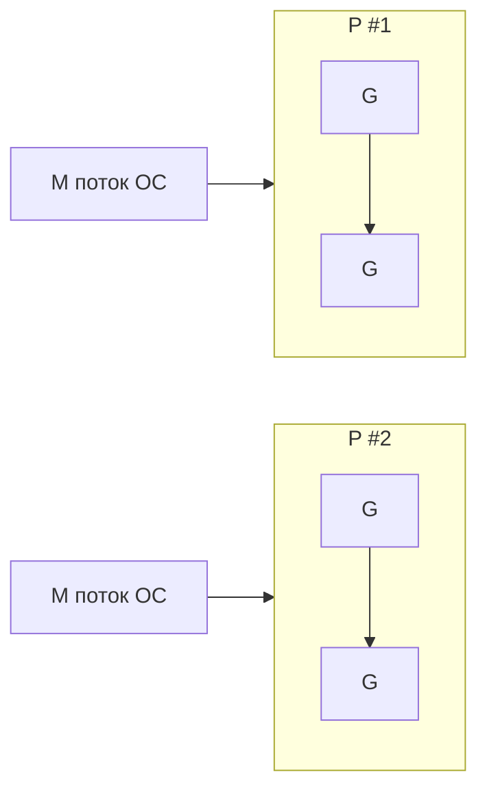

# Go: рантайм и производительность

Этот урок — про «под капотом»: как планировщик GMP раскладывает горутины
по потокам, как работает сборщик мусора, что такое escape analysis (стек
vs куча), как профилировать через pprof и ловить утечки горутин. Эти темы
любят на собесах уровня Middle+/Senior. Простым языком, с прицелом на
устные ответы.

## Планировщик GMP

Go-рантайм мультиплексирует горутины на системные потоки по модели **GMP**:

- **G (Goroutine)** — сама горутина: стек, состояние, функция.
- **M (Machine)** — системный поток ОС, на котором реально исполняется код.
- **P (Processor)** — логический процессор, контекст планирования. Число P
  задаётся `GOMAXPROCS` (по умолчанию = число ядер CPU).

Чтобы исполнять горутину, M должен держать P. У каждого P есть локальная
очередь готовых горутин. Это даёт **work stealing**: если у одного P
очередь опустела, он «крадёт» горутины у другого P.



> [!tip] Что сказать на собесе
> «Горутины (G) исполняются на потоках ОС (M), но через логические
> процессоры (P), которых GOMAXPROCS штук. У каждого P своя очередь, есть
> work stealing. Поэтому миллион горутин живёт на горстке потоков.»

### Блокирующие вызовы и хэндовер

Когда горутина уходит в блокирующий системный вызов, M вместе с ней
«отцепляется», а P передаётся другому свободному M, чтобы остальные
горутины продолжали работать. Так блокировка одной горутины не
останавливает весь P.

Планировщик ещё и **вытесняющий**: длинные горутины прерываются, чтобы не
монополизировать P (asynchronous preemption с Go 1.14).

## Сборщик мусора (GC)

В Go — **конкурентный, трёхцветный mark-and-sweep** сборщик с очень
короткими паузами (stop-the-world обычно меньше миллисекунды). GC работает
параллельно с программой:

- **Mark** — обход достижимых объектов (трёхцветная маркировка: белые,
  серые, чёрные), с write barrier для корректности на лету.
- **Sweep** — освобождение недостижимой памяти.

Частоту GC регулирует `GOGC` (по умолчанию 100): GC запускается, когда куча
выросла на 100% относительно прошлого размера. С Go 1.19 есть ещё
`GOMEMLIMIT` — мягкий лимит памяти.

> [!important] Главное про GC
> GC оптимизирован под **низкие паузы**, а не под максимальную пропускную
> способность. Меньше аллокаций в куче → реже работает GC → стабильнее
> latency.

## Escape analysis: стек или куча

Компилятор Go решает на этапе компиляции, где разместить переменную:

- На **стеке** — если она не «убегает» за пределы функции (дёшево,
  освобождается автоматически при возврате).
- В **куче** — если на неё остаётся ссылка после возврата функции (тогда
  её собирает GC).

Это и есть **escape analysis**. Возврат указателя на локальную переменную
в Go безопасен — переменная просто «убежит» в кучу.

```go
func newUser() *User {
    u := User{Name: "Bob"}
    return &u // u убегает в кучу: ссылка живёт после возврата
}
```

Посмотреть решения компилятора:

```bash
go build -gcflags='-m' ./...
```

> [!tip] Что сказать на собесе
> «Escape analysis решает, попадёт ли переменная на стек или в кучу. Если
> на неё остаётся ссылка после функции — она убегает в кучу и нагружает GC.
> Поэтому лишние указатели и замыкания могут увеличивать аллокации.»

## Указатель или значение: что эффективнее

Распространённый миф «указатель всегда быстрее». На деле:

- Передача **значения** копирует данные, но часто остаётся на стеке и не
  нагружает GC. Для маленьких структур это быстро.
- Передача **указателя** избегает копирования больших структур, но может
  заставить переменную убежать в кучу и добавить работы GC.

Правило: маленькие структуры — по значению; большие или мутируемые — по
указателю. Не угадывай — **бенчмаркай** (`go test -bench -benchmem`).

## Профилирование с pprof

`pprof` — встроенный профилировщик. Профили: CPU, heap (память),
goroutine, block, mutex.

В вебе подключают HTTP-эндпоинты:

```go
import _ "net/http/pprof" // регистрирует /debug/pprof/

go func() {
    http.ListenAndServe("localhost:6060", nil)
}()
```

Снять и посмотреть профиль:

```bash
go tool pprof http://localhost:6060/debug/pprof/heap
go tool pprof http://localhost:6060/debug/pprof/profile?seconds=30
```

В бенчмарках — флагами `-cpuprofile`, `-memprofile`.

## Утечки горутин

Горутина утекает, если она **навсегда заблокирована** и не завершается —
память её стека и удерживаемые ею ресурсы не освобождаются. Типичные
причины:

- Отправка/чтение из канала, который никто не обслуживает.
- Забыли закрыть канал или отменить context.
- `for range` по каналу, который не закрывают.

```go
func leak() {
    ch := make(chan int)
    go func() {
        val := <-ch // заблокируется навсегда: в ch никто не пишет
        fmt.Println(val)
    }()
    // функция вышла, горутина висит вечно
}
```

Лечение: всегда давай горутине путь к завершению — закрытие канала,
`ctx.Done()`, таймаут через `select`. Профиль `goroutine` в pprof
показывает число и стеки живых горутин.

> [!warning] Грабли
> Рост числа горутин со временем — почти всегда признак утечки. Смотри
> `/debug/pprof/goroutine`.

## Практика

Проверь себя — это типовые вопросы с собеса:

> [!quiz] go-gmp-scheduler
> [!quiz] go-escape-analysis
> [!quiz] go-gc
> [!quiz] go-goroutine-leak
> [!quiz] go-pprof

## Итог

- GMP: горутины (G) на потоках ОС (M) через логические процессоры (P =
  GOMAXPROCS), с локальными очередями и work stealing.
- GC — конкурентный трёхцветный mark-and-sweep, оптимизирован под низкие
  паузы; меньше аллокаций → реже GC.
- Escape analysis решает стек vs куча; ссылка, пережившая функцию, убегает
  в кучу.
- Указатель не «всегда быстрее»: маленькое — по значению, большое — по
  указателю, спорное — бенчмаркай.
- pprof профилирует CPU/heap/goroutine; рост горутин = утечка.
