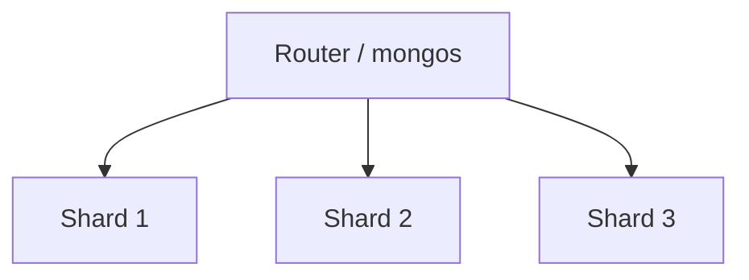

---
id:
title: "MongoDB и документные БД"
estimated_minutes: 16
---

# MongoDB и документные БД

Цель урока — закрыть базу про документные БД и MongoDB: как устроена документная
модель, когда выбирать NoSQL вместо SQL, что такое денормализация, индексы и
агрегации, а также «теоретический минимум» — CAP-теорема, репликасеты и
шардирование. И отдельно — чем отличаются типы NoSQL между собой. Простым
языком, с прицелом на устные ответы.

## Документная модель

MongoDB — **документная NoSQL БД**. Вместо строк в таблицах она хранит
**документы** (JSON-подобные, физически BSON) внутри **коллекций**.

- **Документ** — запись с гибкой структурой (вложенные объекты, массивы).
- **Коллекция** — набор документов (аналог таблицы, но без жёсткой схемы).
- У документов в одной коллекции **может быть разный набор полей** —
  схема гибкая (schema-less / schema-flexible).

```json
{
  "_id": ObjectId("..."),
  "name": "Alice",
  "tags": ["php", "go"],
  "address": { "city": "Moscow", "zip": "101000" },
  "orders": [ { "id": 1, "sum": 500 } ]
}
```

> [!tip] Что сказать на собесе
> «MongoDB хранит документы (BSON) в коллекциях. Схема гибкая, документ может
> содержать вложенные объекты и массивы — удобно класть агрегат целиком одним
> чтением, без JOIN.»

## Когда NoSQL, а когда SQL

Это любимый вопрос. Коротко:

**SQL (PostgreSQL/MySQL) лучше, когда:**
- данные сильно связаны, нужны JOIN и сложные запросы;
- важны строгие транзакции ACID и целостность;
- схема стабильна.

**NoSQL (MongoDB) лучше, когда:**
- гибкая/меняющаяся схема, разнородные документы;
- данные читаются как единый агрегат (документ целиком);
- нужна простая горизонтальная масштабируемость на запись/чтение;
- очень большой объём и высокая нагрузка с простыми запросами по ключу.

> [!warning] Грабли
> «NoSQL = нет схемы = можно не думать о модели» — неверно. Схему всё равно
> проектируют, просто на уровне приложения и под паттерны доступа (как читаем,
> так и храним).

## Схема и денормализация

В SQL мы нормализуем (разносим данные по таблицам, убираем дублирование). В
документных БД часто наоборот — **денормализуют**: кладут связанные данные в
один документ, чтобы читать за одно обращение, без JOIN.

- **Embedding (вложение)** — хранить связанные данные внутри документа.
  Хорошо при «читаем вместе», ограниченном размере, отношении один-ко-многим.
- **Referencing (ссылки)** — хранить `_id` и связывать на стороне приложения.
  Хорошо при больших/часто меняющихся данных и many-to-many.

Денормализация ускоряет чтение ценой дублирования и более сложных обновлений
(одни и те же данные надо обновлять в нескольких местах).

## Индексы

Как и в SQL, без индекса Mongo делает **collection scan**. Индексы ускоряют
поиск и сортировку.

- По умолчанию есть индекс на `_id`.
- Бывают одиночные, **составные** (по нескольким полям, важен порядок),
  по полям массива (**multikey**), текстовые, geo, TTL-индексы (авто-удаление).
- Тот же принцип, что в реляционных БД: индексы ускоряют чтение, но замедляют
  запись и едят память.

> [!tip] Что сказать на собесе
> «Индексы в Mongo работают как в SQL: ускоряют выборку/сортировку, но
> замедляют запись. Есть составные (важен порядок полей), multikey по массивам
> и TTL-индексы для авто-истечения документов.»

## Агрегации (кратко)

Для аналитики и сложных преобразований в Mongo есть **aggregation pipeline** —
данные проходят через стадии конвейера:

- `$match` — фильтрация (аналог WHERE);
- `$group` — группировка и агрегаты (аналог GROUP BY);
- `$sort`, `$project`, `$lookup` (аналог JOIN), `$limit` и др.

```text
[ { $match: { status: "paid" } },
  { $group: { _id: "$userId", total: { $sum: "$sum" } } },
  { $sort:  { total: -1 } } ]
```

## CAP-теорема

CAP — фундаментальная теорема про распределённые системы. Из трёх свойств можно
гарантировать одновременно только **два**:

- **C (Consistency)** — все узлы видят одни и те же актуальные данные.
- **A (Availability)** — система всегда отвечает (не отдаёт ошибку).
- **P (Partition tolerance)** — система продолжает работать при разрыве сети
  между узлами.

Ключевой момент: в реальной распределённой системе **сетевые разрывы неизбежны**,
поэтому P обязателен. Значит, реальный выбор — между **CP** и **AP**:

- **CP** — при разрыве жертвуем доступностью ради консистентности (часть узлов
  откажет в ответе, лишь бы не отдать устаревшее).
- **AP** — при разрыве жертвуем консистентностью ради доступности (отвечаем, но
  данные могут быть устаревшими — eventual consistency).

> [!tip] Что сказать на собесе
> «P в распределёнке обязателен, потому что сеть рвётся. Поэтому выбираем между
> CP и AP. MongoDB по умолчанию ближе к CP (через primary), а, например,
> Cassandra/DynamoDB — AP с eventual consistency.»

## Репликасеты

**Replica set** в MongoDB — группа узлов с одинаковыми данными для отказо-
устойчивости:

- один **primary** принимает записи;
- несколько **secondary** реплицируют данные с primary;
- при падении primary проводятся **выборы** нового primary;
- читать можно с secondary (read preference), но это даёт eventual consistency.

## Шардирование

**Sharding** — горизонтальное масштабирование: данные разбиваются по **шардам**
(серверам) по **shard key**. Каждый шард хранит свой кусок данных.

- Хороший shard key даёт равномерное распределение и не создаёт «горячих» шардов.
- Позволяет масштабировать запись и объём за пределы одного сервера.
- Усложняет запросы, которые не используют shard key (идут на все шарды).



## Типы NoSQL

NoSQL — это не только документные БД. Четыре основных семейства:

- **Документные** (MongoDB, CouchDB) — документы с гибкой схемой.
- **Ключ-значение** (Redis, DynamoDB, Memcached) — простое `key → value`,
  максимально быстрый доступ по ключу.
- **Колоночные / wide-column** (Cassandra, HBase) — данные по колонкам,
  огромные объёмы, запись с высокой нагрузкой.
- **Графовые** (Neo4j) — узлы и связи, для сильно связанных данных
  (соцсети, графы знаний).

## Практика

Проверь себя — это типовые вопросы с собеса:

> [!quiz] mongo-document-model
> [!quiz] mongo-sql-vs-nosql
> [!quiz] mongo-denormalization
> [!quiz] nosql-cap-theorem
> [!quiz] mongo-replication-sharding
> [!quiz] nosql-types

## Итог

- MongoDB — документная БД: документы (BSON) в коллекциях, гибкая схема.
- SQL — связи/JOIN/ACID/стабильная схема; NoSQL — гибкая схема, агрегат целиком,
  горизонтальное масштабирование.
- Денормализация: embedding vs referencing — читаем быстрее ценой дублирования.
- Индексы как в SQL (составные, multikey, TTL); агрегации — pipeline стадий.
- CAP: P обязателен → выбор CP vs AP; Mongo ближе к CP.
- Replica set (primary/secondary + выборы), sharding по shard key.
- Типы NoSQL: документные, ключ-значение, колоночные, графовые.
