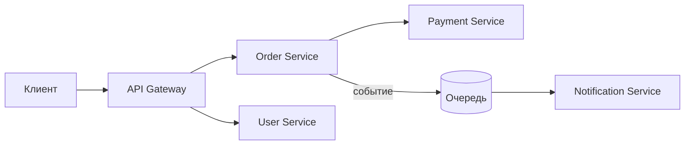

# Микросервисная архитектура

Цель урока — разобраться, что такое микросервисы, чем они отличаются от
монолита, как нарезать сервисы по границам и какие паттерны решают типовые
проблемы распределённых систем. Простым языком, с прицелом на устные ответы.

## Что это и зачем

**Микросервисная архитектура** — это подход, при котором приложение строится
как набор небольших независимых сервисов. Каждый сервис отвечает за свою
бизнес-возможность, разворачивается отдельно, имеет собственную базу данных и
общается с другими по сети (HTTP/gRPC, очереди сообщений).

Главная мотивация — не «модно», а **независимость**: команды деплоят свои
сервисы отдельно, масштабируют только узкие места, могут использовать разные
языки и хранилища под задачу.

> [!tip] Что сказать на собесе
> «Микросервис — это независимо развёртываемый сервис вокруг одной бизнес-
> возможности, со своей БД. Ключевая ценность — независимость деплоя и
> масштабирования, цена — сложность распределённой системы.»

## Монолит vs микросервисы

Монолит — это одно приложение, один деплой, одна (обычно) база. Это не «плохо»:
для маленькой команды и небольшого продукта монолит проще, дешевле и быстрее.

| | Монолит | Микросервисы |
|---|---|---|
| Деплой | целиком | каждый сервис отдельно |
| Масштабирование | всё приложение | точечно по сервисам |
| Транзакции | локальные ACID | распределённые (сложно) |
| Отладка | проще | сложнее (трейсинг) |
| Команды | мешают друг другу | работают независимо |

Микросервисы дают независимость и гибкость, но платишь за это сетевыми
вызовами, eventual consistency, сложным деплоем и наблюдаемостью.

> [!warning] Частая ошибка
> Начинать новый проект сразу с микросервисов. Обычно дешевле начать с
> «модульного монолита» и выделять сервисы по мере роста и реальной боли.

## Границы сервисов: bounded context

Самый сложный вопрос — **как нарезать** систему на сервисы. Хорошая граница
идёт по бизнес-возможности, а не по техническому слою. Здесь помогает
**DDD bounded context**: внутри контекста термины и модель данных согласованы
(«заказ» в биллинге и «заказ» в доставке — это разные модели).

Признаки удачной границы: сервис владеет своими данными, у него мало
синхронных зависимостей, его можно менять не трогая соседей. Если два «сервиса»
постоянно меняются вместе — скорее всего это один сервис.

## Синхронное vs асинхронное взаимодействие

- **Синхронно** (REST/gRPC, запрос-ответ): просто, но создаёт временную связь —
  если вызываемый сервис лёг или тормозит, страдает и вызывающий. Длинные
  цепочки синхронных вызовов опасны.
- **Асинхронно** (очереди/события: Kafka, RabbitMQ): отправитель не ждёт
  ответа, сервисы развязаны во времени, лучше переносят пики и сбои. Цена —
  eventual consistency и сложнее проследить поток.

## Паттерны микросервисов

- **API Gateway** — единая точка входа для клиентов. Маршрутизирует запросы,
  делает аутентификацию, rate limiting, агрегацию ответов. Клиент не знает про
  внутреннюю топологию сервисов.
- **Service Discovery** — механизм, как сервисы находят друг друга по имени, а
  не по жёстким IP (Consul, etcd, DNS в k8s). Адреса меняются при
  масштабировании, нужен реестр.
- **Circuit Breaker** — «предохранитель». Если зависимость стабильно падает,
  breaker «размыкается» и быстро отдаёт ошибку/фолбэк, не дожидаясь таймаутов.
  Защищает от каскадных отказов.
- **Saga** — способ делать бизнес-транзакцию через несколько сервисов без
  распределённого 2PC. Это последовательность локальных транзакций; при сбое
  выполняются **компенсирующие** действия (откат через обратную операцию).
  Бывает оркестрация (центральный координатор) и хореография (по событиям).

> [!info] Идемпотентность
> В распределённой системе сообщение может прийти повторно (ретраи, at-least-once
> доставка). Операция **идемпотентна**, если повтор не меняет результат. Типовой
> приём — ключ идемпотентности (`Idempotency-Key`) или проверка уже обработанного
> ID, чтобы не списать деньги дважды.

## Наблюдаемость: distributed tracing

В монолите стек-трейс показывает весь путь. В микросервисах один запрос проходит
через много сервисов. **Distributed tracing** (OpenTelemetry, Jaeger, Zipkin)
прокидывает общий `trace_id` через все вызовы, чтобы собрать единую картину:
где время потерялось, какой сервис вернул ошибку.

## Проблемы распределённых систем

«Заблуждения о распределённых вычислениях»: **сеть не надёжна**, latency не ноль,
пропускная способность ограничена, топология меняется. Из этого следует:

- Любой сетевой вызов может упасть или зависнуть — нужны таймауты и ретраи.
- Ретраи требуют идемпотентности, иначе словишь дубли.
- Согласованность между сервисами обычно **eventual consistency** — данные
  сходятся не мгновенно. По CAP при сетевом разделении выбираешь между
  доступностью и строгой согласованностью.

## Практика

Проверь себя — это типовые вопросы с собеса:

> [!quiz] mono-vs-micro
> [!quiz] micro-pros-cons
> [!quiz] patterns-matching
> [!quiz] saga-transactions
> [!quiz] idempotency
> [!quiz] distributed-fallacies

## Итог

- Микросервис — независимо развёртываемый сервис вокруг бизнес-возможности со
  своей БД. Ценность — независимость, цена — сложность распределёнки.
- Границы режем по bounded context, а не по техническим слоям.
- Синхронно — просто, но связывает; асинхронно — развязывает, но eventual
  consistency.
- Паттерны: API Gateway, Service Discovery, Circuit Breaker, Saga.
- Сеть ненадёжна → таймауты, ретраи, идемпотентность, distributed tracing.
