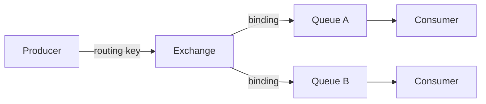

# Основы очередей и RabbitMQ

Цель урока — закрыть базу про очереди сообщений, которую почти всегда спрашивают
на собесе: зачем они вообще нужны, какие бывают гарантии доставки, что такое
идемпотентность консьюмера и как устроена модель RabbitMQ. Простым языком, с
прицелом на устные ответы.

## Зачем нужны очереди

Очередь сообщений — это посредник (брокер) между теми, кто шлёт сообщения
(**producer**), и теми, кто их обрабатывает (**consumer**). Три главные причины
её ставить:

- **Decoupling (развязка)**. Producer не знает про consumer и не ждёт его. Можно
  менять, перезапускать и масштабировать потребителей независимо от отправителя.
- **Сглаживание нагрузки (load leveling)**. Пиковый трафик складывается в
  очередь, а консьюмеры разбирают его в своём темпе. Сервис не падает от всплеска.
- **Асинхронность**. Тяжёлую работу (отправка письма, генерация отчёта) выносим
  из HTTP-запроса: положили задачу в очередь и сразу ответили пользователю.

> [!tip] Что сказать на собесе
> «Очередь даёт развязку продюсера и консьюмера, сглаживает пиковую нагрузку и
> позволяет делать тяжёлую работу асинхронно, не блокируя запрос пользователя.»

## Producer и consumer

- **Producer** публикует сообщение в брокер.
- **Брокер** хранит сообщение, пока его не заберут.
- **Consumer** читает сообщение, обрабатывает и подтверждает обработку.

Несколько консьюмеров могут читать из одной очереди — это горизонтальное
масштабирование обработки.

## Гарантии доставки

Это любимый вопрос. Есть три модели:

- **at-most-once** («не больше одного раза»). Сообщение может потеряться, но
  дубля не будет. Подтверждаем до обработки или вообще без ack. Просто и быстро,
  но теряем данные при сбое.
- **at-least-once** («хотя бы один раз»). Сообщение точно дойдёт, но возможны
  **дубли** (если консьюмер упал после обработки, но до ack — сообщение
  переотправят). Самый частый практичный выбор.
- **exactly-once** («ровно один раз»). Без потерь и без дублей. Дорого и сложно:
  в чистом виде на уровне сети почти недостижимо, обычно эмулируется через
  at-least-once + **идемпотентность** на стороне консьюмера.

> [!important] Главная мысль
> На практике берут **at-least-once** и делают консьюмер **идемпотентным** — это
> и есть «практический exactly-once».

## Идемпотентность консьюмера

Идемпотентность — это когда повторная обработка того же сообщения не меняет
результат. Раз дубли при at-least-once неизбежны, консьюмер должен быть готов
увидеть одно и то же сообщение дважды.

Как добиваются:

- **Ключ идемпотентности** (message id) — храним обработанные id, дубль
  отбрасываем.
- **Upsert вместо insert** — повторная запись не создаёт второй ряд.
- **Условные операции** — «списать деньги, только если ещё не списывали по этому
  id».

```php
// Идемпотентная обработка по message id
function handle(Message $msg): void
{
    if ($this->processed->exists($msg->id)) {
        return; // дубль — уже обработали
    }
    $this->doWork($msg);
    $this->processed->add($msg->id);
}
```

## Модель RabbitMQ

RabbitMQ — это брокер с моделью **AMQP**. Producer шлёт сообщение **не прямо в
очередь**, а в **exchange**. Exchange по правилам (**binding**) маршрутизирует
сообщение в одну или несколько **очередей**.



Ключевые сущности:

- **Exchange** — точка входа, маршрутизатор.
- **Queue** — буфер, где сообщения ждут консьюмера.
- **Binding** — правило связи exchange → queue.
- **Routing key** — «адрес» сообщения, по которому exchange решает, куда слать.

## Типы exchange

- **direct** — точное совпадение routing key с ключом binding. Адресная
  доставка в конкретную очередь.
- **topic** — совпадение по шаблону с `*` (одно слово) и `#` (ноль и более
  слов), например `order.*.created`. Гибкая маршрутизация по паттерну.
- **fanout** — игнорирует routing key, шлёт во **все** привязанные очереди.
  Это broadcast.
- **headers** — маршрутизация по заголовкам сообщения, а не по routing key.

## ack, nack и подтверждения

Консьюмер должен подтвердить обработку:

- **ack** — успешно обработано, брокер удаляет сообщение.
- **nack** (или reject) — не обработано. С флагом `requeue=true` сообщение
  вернётся в очередь, с `requeue=false` — уйдёт дальше (например в DLQ).

Если консьюмер упал, не прислав ack, брокер вернёт сообщение в очередь —
отсюда и берётся at-least-once.

> [!warning] Грабли
> Если делать ack **до** обработки (autoack), при падении консьюмера сообщение
> потеряется — это at-most-once. Для надёжности ack ставят **после** успешной
> обработки.

## Dead Letter Queue (DLQ)

DLQ — отдельная очередь для «мёртвых» сообщений. Туда попадают сообщения,
которые:

- отклонены с `requeue=false`,
- превысили лимит повторов,
- протухли по TTL.

DLQ спасает от бесконечного цикла переобработки «ядовитого» сообщения (poison
message) и даёт место для разбора проблем вручную.

## Prefetch

**prefetch** (`basic.qos`) ограничивает, сколько неподтверждённых сообщений
брокер отдаст одному консьюмеру за раз. Без лимита быстрый брокер завалит
консьюмер тысячами сообщений, и нагрузка распределится неравномерно.

- Маленький prefetch (1) — честное распределение между консьюмерами, но больше
  сетевых раундов.
- Большой prefetch — выше throughput, но риск перекоса нагрузки.

## Практика

Проверь себя — это типовые вопросы с собеса:

> [!card] mq-why
> [!card] mq-delivery-guarantees
> [!card] mq-idempotency
> [!card] rabbit-exchange-types
> [!card] rabbit-routing-flow
> [!card] rabbit-ack-dlq

## Итог

- Очередь даёт развязку, сглаживание нагрузки и асинхронность.
- Гарантии: at-most-once (теряем), at-least-once (дубли), exactly-once (дорого).
- На практике — at-least-once + идемпотентный консьюмер.
- RabbitMQ: producer → exchange → (binding/routing key) → queue → consumer.
- Типы exchange: direct, topic, fanout, headers.
- ack после обработки, nack/requeue, DLQ для «мёртвых» сообщений, prefetch для
  контроля нагрузки.
