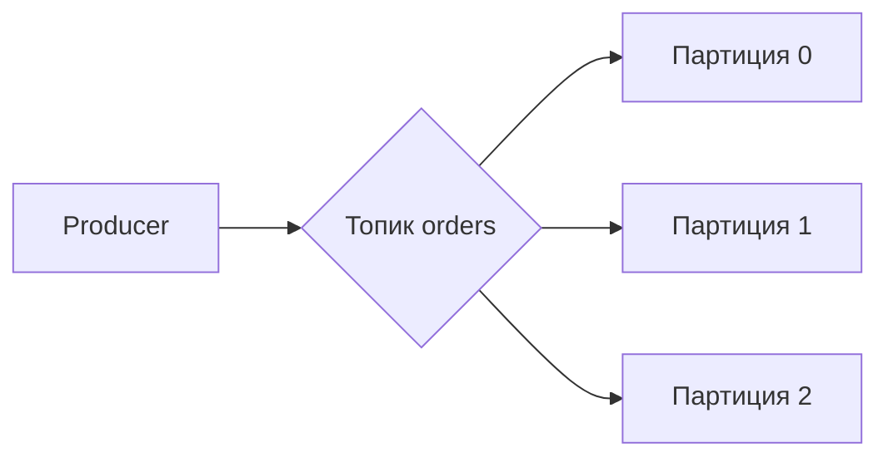
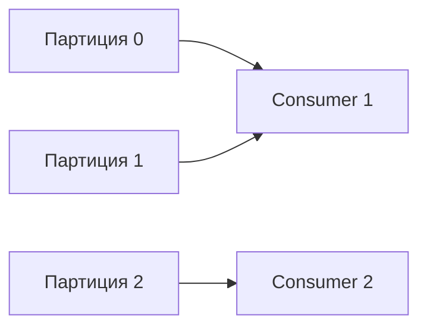

---
id:
title: "Apache Kafka"
estimated_minutes: 15
---

# Apache Kafka

Kafka — это не «обычная очередь», а распределённый **лог сообщений**. На собесе
ценят понимание, чем лог-модель отличается от брокера вроде RabbitMQ и когда что
выбирать. Разберём топики, партиции, offset, consumer group, репликацию и
rebalance.

## Лог-ориентированная модель

В RabbitMQ сообщение удаляется после ack. В Kafka сообщения пишутся в
**append-only log** — упорядоченный, неизменяемый журнал. Сообщение **не
удаляется** после чтения; оно лежит, пока не истечёт **retention** (по времени
или по размеру).

Главное следствие: разные потребители читают один и тот же лог независимо,
каждый со своей позиции. Можно «перемотать» назад и перечитать историю.

> [!tip] Что сказать на собесе
> «Kafka — это распределённый персистентный лог. Сообщения не удаляются после
> чтения, а живут до конца retention; консьюмеры читают по своему offset и могут
> перечитывать.»

## Топики и партиции

- **Топик** — именованный поток сообщений (например `orders`).
- Топик делится на **партиции** — независимые упорядоченные логи.
- Партиция — единица параллелизма и масштабирования. Больше партиций — больше
  параллельных консьюмеров.

## Offset

**Offset** — порядковый номер сообщения внутри партиции. Консьюмер хранит свой
offset (обычно коммитит в Kafka) и так помнит, докуда дочитал.

- Коммит offset = «я обработал до сюда».
- Сдвиг offset назад = перечитать сообщения заново.
- Offset уникален в пределах партиции, а не топика целиком.

## Key → партиция и порядок

Producer может задать **ключ** сообщения. Kafka считает хэш ключа и всегда
кладёт сообщения с одним ключом в **одну и ту же партицию**.

- **Порядок гарантируется только внутри партиции**, а не по топику в целом.
- Хотите упорядоченность по сущности (например по `user_id`) — используйте её как
  ключ, тогда все её события лягут в одну партицию по порядку.
- Без ключа сообщения распределяются по партициям равномерно (round-robin), и
  глобального порядка нет.

> [!important] Частый вопрос
> «Гарантирует ли Kafka порядок?» — Да, но **только внутри партиции**. Глобального
> порядка по топику нет.

## Consumer group и распределение партиций

**Consumer group** — группа консьюмеров с общим `group.id`, которые вместе
читают топик.

- Каждую партицию в группе читает **ровно один** консьюмер.
- Партиций больше либо равно числу консьюмеров — иначе лишние консьюмеры простаивают.
- Разные группы читают один топик независимо (каждая со своими offset).

То есть параллелизм обработки в группе ограничен числом партиций.

## Репликация и ISR

Каждая партиция имеет **реплики** на разных брокерах: один **лидер** и
несколько **фолловеров**.

- Все чтения/записи идут через лидера, фолловеры догоняют его.
- **ISR (In-Sync Replicas)** — реплики, которые успевают за лидером.
- `acks=all` + `min.insync.replicas` означают, что запись подтверждается только
  после записи в нужное число синхронных реплик — это про надёжность от потери
  данных при падении брокера.

## Retention

Kafka хранит сообщения по политике **retention**:

- по времени (`retention.ms`, например 7 дней),
- по размеру (`retention.bytes`),
- либо **log compaction** — оставлять только последнее значение для каждого ключа.

Сообщение можно перечитать, пока оно не вышло за retention. Это позволяет
использовать Kafka как источник правды и переигрывать события.

## Rebalance

**Rebalance** — перераспределение партиций между консьюмерами группы. Случается,
когда консьюмер присоединился, отвалился или изменилось число партиций.

Во время rebalance обработка в группе приостанавливается (stop-the-world у
классического протокола), поэтому частые ребалансы — это боль. Помогают
правильные таймауты (`session.timeout.ms`, `max.poll.interval.ms`) и
кооперативный протокол ребаланса.

## Kafka vs RabbitMQ: когда что выбирать

- **Kafka** — высокий throughput, стриминг событий, хранение и переигрывание
  истории, аналитика, много независимых потребителей одного потока. Это лог.
- **RabbitMQ** — классические задачи/очереди работ, гибкая маршрутизация
  (exchange/routing), приоритеты, сложная логика доставки, низкая задержка на
  команду. Это брокер задач.

> [!tip] Что сказать на собесе
> «Нужен поток событий, переигрывание и высокий throughput — Kafka. Нужна гибкая
> маршрутизация и очередь задач с подтверждениями и DLQ — RabbitMQ.»

## Практика

Проверь себя — это типовые вопросы с собеса:

> [!quiz] kafka-log-model
> [!quiz] kafka-partitions-offset
> [!quiz] kafka-key-order
> [!quiz] kafka-consumer-group
> [!quiz] kafka-replication-rebalance
> [!quiz] kafka-vs-rabbit

## Итог

- Kafka — распределённый персистентный лог: сообщения не удаляются после чтения,
  живут до конца retention.
- Топик делится на партиции; offset — позиция внутри партиции.
- Ключ → партиция; порядок гарантируется только внутри партиции.
- Consumer group: одну партицию читает один консьюмер, параллелизм ≤ числу партиций.
- Репликация (лидер/фолловеры, ISR) защищает от потери данных.
- Kafka — для потоков событий и throughput, RabbitMQ — для очередей задач и
  гибкой маршрутизации.
