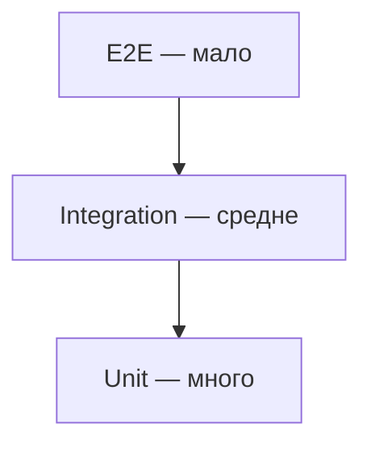

# Тестирование

Цель урока — за 15 минут разложить по полочкам тему, которую любят на собесе:
зачем нужны тесты, какие они бывают, чем unit отличается от integration, что
такое моки и стабы, что такое TDD и почему «100% покрытие» — не самоцель.
Простым языком, с прицелом на устные ответы.

## Пирамида тестов

Классическая модель: тестов разного уровня должно быть разное количество.

- **Unit (низ, их много)** — быстрые, изолированные, проверяют одну единицу
  кода (функцию, метод, класс) без внешних зависимостей.
- **Integration (середина)** — проверяют, что несколько компонентов работают
  вместе: код + реальная БД, код + очередь, два сервиса через HTTP.
- **E2E / UI (верх, их мало)** — гоняют систему целиком как пользователь:
  медленные, хрупкие, дорогие в поддержке.



> [!tip] Что сказать на собесе
> «Чем выше по пирамиде — тем медленнее и хрупче тест. Поэтому много быстрых
> unit-тестов внизу, поменьше интеграционных в середине и совсем чуть-чуть
> e2e наверху. Антипаттерн — перевёрнутая пирамида (или “стакан с мороженым”),
> где всё держится на медленных e2e.»

## Что такое unit-тест и его изоляция

Unit-тест проверяет **одну единицу поведения в изоляции** от внешнего мира.
Изоляция значит: никакой реальной БД, сети, файловой системы, текущего времени
и случайных чисел. Всё внешнее подменяется тестовыми двойниками.

Хороший unit-тест: быстрый (миллисекунды), детерминированный (всегда даёт один
результат), независимый от других тестов и от порядка запуска.

## Тестовые двойники: мок, стаб, фейк

«Test doubles» — это подмены реальных зависимостей. Их часто путают:

- **Stub** — отдаёт заранее заданные ответы. Нужен, чтобы протестировать код
  ввода (state): «когда репозиторий вернёт пользователя — что сделает сервис».
- **Mock** — это стаб + проверка взаимодействия. Тест падает, если ожидаемый
  вызов не произошёл (или произошёл не так). Проверяет поведение (behavior):
  «сервис должен ровно один раз вызвать `gateway.charge()`».
- **Fake** — рабочая, но упрощённая реализация (например, in-memory репозиторий
  вместо настоящей БД).

> [!warning] Грабли
> Перебор с моками делает тесты хрупкими: они проверяют реализацию, а не
> результат. Если можно проверить итоговое состояние стабом — обычно лучше
> стаб, чем мок на каждый чих.

## Integration-тесты

Integration-тест проверяет связку с реальной зависимостью: настоящая БД (часто
в Docker / Testcontainers), реальный HTTP между сервисами, реальная очередь.
Они медленнее unit, зато ловят то, что моки скрывают: неверный SQL, проблемы
сериализации, несовпадение схемы.

## TDD кратко

**Test-Driven Development** — пишем тест до кода. Цикл «red — green — refactor»:

1. **Red** — пишем падающий тест на ещё не реализованное поведение.
2. **Green** — пишем минимальный код, чтобы тест прошёл.
3. **Refactor** — чистим код, тесты остаются зелёными.

TDD заставляет думать о контракте раньше реализации и даёт тесты «бесплатно».

## AAA: структура теста

**Arrange — Act — Assert**: подготовь данные и моки, выполни проверяемое
действие, проверь результат. Один тест — одна проверяемая мысль.

```go
func TestDiscount(t *testing.T) {
    // Arrange
    cart := Cart{Total: 100}
    // Act
    got := cart.WithDiscount(10)
    // Assert
    if got.Total != 90 {
        t.Errorf("got %d, want 90", got.Total)
    }
}
```

## Табличные тесты в Go

Идиома Go: один тест перебирает набор кейсов из таблицы. Меньше дублирования,
легко добавить новый случай. Часто с `t.Run` для подтестов.

```go
func TestAbs(t *testing.T) {
    tests := []struct {
        name string
        in   int
        want int
    }{
        {"positive", 5, 5},
        {"negative", -5, 5},
        {"zero", 0, 0},
    }
    for _, tt := range tests {
        t.Run(tt.name, func(t *testing.T) {
            if got := Abs(tt.in); got != tt.want {
                t.Errorf("Abs(%d) = %d, want %d", tt.in, got, tt.want)
            }
        })
    }
}
```

## Покрытие и его ограничения

**Coverage** показывает, какие строки/ветки кода выполнились во время тестов.
Это полезная диагностика «что вообще не протестировано», но **не цель сама по
себе**.

- 100% покрытия не значит «нет багов»: можно выполнить строку, ничего не
  проверив ассертом.
- Высокое покрытие на геттерах/DTO — пустая метрика.
- Гнаться за процентом ради процента — путь к бесполезным тестам.

> [!tip] Что сказать на собесе
> «Покрытие — это индикатор непокрытых мест, а не гарантия качества. Я смотрю
> на покрытие критичной бизнес-логики, а не на голую цифру по проекту.»

## Что тестировать, а что нет

- **Стоит**: бизнес-логику, граничные случаи, обработку ошибок, баги (тест на
  регресс).
- **Не стоит**: тривиальные геттеры/сеттеры, чужой фреймворк, язык. Не тестируй
  реализацию — тестируй наблюдаемое поведение.

## Флаки-тесты

**Flaky** — тест, который то падает, то проходит без изменений кода. Причины:
зависимость от времени, порядка выполнения, реального времени/сна, сети,
общего состояния, гонок. Флаки подрывают доверие к набору тестов — их чинят
или карантинят, но не игнорируют.

## Практика

Проверь себя — это типовые вопросы с собеса:

> [!quiz] test-pyramid
> [!quiz] test-doubles
> [!quiz] unit-vs-integration
> [!quiz] tdd-cycle
> [!quiz] go-table-tests
> [!quiz] test-coverage

## Итог

- Пирамида: много unit, меньше integration, чуть-чуть e2e.
- Unit изолирован от БД/сети/времени; integration проверяет реальную связку.
- Stub — отдаёт ответы, mock — ещё и проверяет вызовы, fake — упрощённая
  рабочая реализация.
- TDD: red — green — refactor. Тест строй по AAA.
- В Go удобны табличные тесты с `t.Run`.
- Coverage — индикатор, а не цель. Тестируй поведение, а не реализацию.
- Флаки-тесты чини, не игнорируй.
