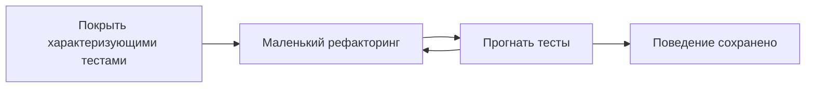

# Рефакторинг, процессы и оптимизация

Цель урока — закрыть «человеческую» часть собеса: как безопасно рефакторить
legacy, что искать на code review, как устроен Scrum и как правильно
оптимизировать производительность. Здесь редко спрашивают точное определение —
ценят опыт и здравый смысл. Готовься отвечать примерами.

## Рефакторинг: что это и что не это

**Рефакторинг** — изменение внутренней структуры кода без изменения его
внешнего поведения. Цель — читаемость и поддерживаемость, не новые фичи.

> [!important] Ключевая мысль
> Рефакторинг и добавление функциональности — это два разных режима. Не делай
> их в одном коммите: иначе непонятно, что сломало поведение.

## Рефакторинг legacy: маленькими шагами

Главная опасность legacy — код без тестов. Менять его вслепую рискованно.
Безопасный порядок:

1. **Сначала характеризующие тесты** (characterization tests) — фиксируем
   текущее поведение «как есть», даже если оно странное. Это страховочная сеть.
2. **Маленькие шаги** — рефакторим понемногу, прогоняя тесты после каждого.
3. **Без смены поведения** — пока рефакторим, ведём себя ровно как раньше.

> [!tip] Что сказать на собесе
> «Прежде чем трогать legacy, я оборачиваю его характеризующими тестами,
> которые фиксируют текущее поведение. Дальше — маленькими шагами с прогоном
> тестов после каждого изменения.»

## Code smells

«Запахи кода» — признаки, что код стоит отрефакторить (но это не баг сам по
себе):

- **Длинный метод / большой класс** — слишком много ответственности.
- **Дублирование** (copy-paste).
- **Длинный список параметров**.
- **Магические числа** без имени.
- **Feature envy** — метод лезет в данные чужого класса.
- **Shotgun surgery** — одно изменение требует правок в куче мест.

## Code review: что смотреть и зачем

Ревью — это не только поиск багов. На что смотрят:

- **Корректность** и граничные случаи.
- **Читаемость** и понятность имён.
- **Тесты** — есть ли, покрывают ли суть.
- **Безопасность** (инъекции, утечки секретов) и **производительность** (N+1,
  лишние запросы).
- **Соответствие договорённостям** команды и архитектуре.

Зачем: распространение знаний по команде, единый стиль, раннее выявление
проблем (исправить на ревью дешевле, чем на проде).

> [!tip] Что сказать на собесе
> «Ревью — про качество и общее владение кодом, а не про придирки. Комментарии
> по делу, тон уважительный, спорные вещи обсуждаем, а не навязываем.»

## Agile и Scrum

**Agile** — это набор принципов (итеративность, ценность для пользователя,
готовность к изменениям). **Scrum** — конкретный фреймворк поверх Agile.

### Роли

- **Product Owner (PO)** — отвечает за продукт и приоритеты, владеет бэклогом,
  решает «что и зачем».
- **Scrum Master (SM)** — помогает процессу, убирает препятствия, следит за
  церемониями. Не начальник команды.
- **Команда разработки** — кросс-функциональная, сама решает «как» и оценивает
  объём.

### Артефакты

- **Product Backlog** — общий упорядоченный список всего, что нужно сделать.
- **Sprint Backlog** — то, что команда взяла в текущий спринт.
- **Инкремент** — готовый рабочий результат спринта.

### Церемонии

- **Sprint** — фиксированный отрезок (обычно 1-2 недели).
- **Planning** — что берём в спринт и как.
- **Daily** — короткая ежедневная синхронизация (что сделал, что буду, что
  мешает).
- **Review** — показываем инкремент стейкхолдерам, собираем обратную связь.
- **Retrospective** — что улучшить в самом процессе работы команды.

> [!tip] Что сказать на собесе
> «Daily — это не отчёт начальнику, а синхронизация команды: фокус на
> препятствиях. Review — про продукт, retro — про процесс.»

## Оптимизация производительности

Главное правило: **сначала измерь, потом оптимизируй**. Не угадывай узкое
место — найди его профилировщиком.

1. **Измерь** — собери метрики/профиль (pprof в Go, Xdebug/Blackfire в PHP,
   EXPLAIN для SQL).
2. **Найди узкое место** (bottleneck) — где реально уходит время: БД, сеть, CPU,
   память.
3. **Оптимизируй именно его** — точечно, а не «всё подряд».
4. **Перепроверь** — измерь снова, убедись, что стало лучше и ничего не сломал.

> [!warning] Грабли
> Преждевременная оптимизация — корень зла. Оптимизация без замера часто бьёт
> мимо: ускоряют то, что и так быстрое, а реальный тормоз остаётся.

### Типичные узкие места

- **БД** — самый частый виновник. Особенно **проблема N+1**: вместо одного
  запроса с join делается 1 + N запросов в цикле. Лечится join/предзагрузкой
  (eager loading) и батчингом.
- **Сеть** — много мелких round-trip к сервисам/БД; помогает батчинг и
  уменьшение числа вызовов.
- **CPU** — тяжёлые вычисления, неэффективные алгоритмы (O(n^2) там, где можно
  O(n log n)).

### Кеширование

Кеш — мощный инструмент, но не «серебряная пуля»: добавляет проблему
инвалидации и риск устаревших данных. Кешируй то, что часто читают и редко
меняют, и продумывай, когда и как сбрасывать.

## Практика

Проверь себя — это типовые вопросы с собеса:

> [!quiz] refactoring-legacy
> [!quiz] code-smells
> [!quiz] code-review
> [!quiz] scrum-roles
> [!quiz] scrum-ceremonies
> [!quiz] perf-optimization

## Итог

- Рефакторинг меняет структуру, не поведение; legacy сначала покрывают
  характеризующими тестами, потом правят маленькими шагами.
- На ревью смотрят корректность, читаемость, тесты, безопасность и
  производительность; цель — качество и общее владение кодом.
- Scrum: PO владеет бэклогом («что»), SM помогает процессу, команда решает
  «как». Церемонии: planning, daily, review, retro.
- Оптимизация: измерь — найди bottleneck — оптимизируй — перепроверь. Частые
  тормоза: БД (N+1), сеть, CPU. Кеш помогает, но создаёт инвалидцию.
